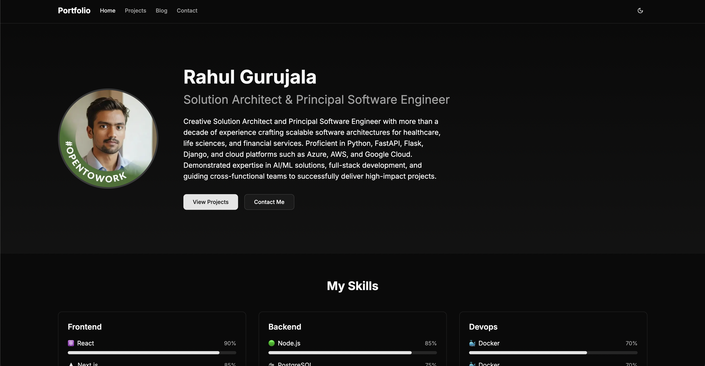
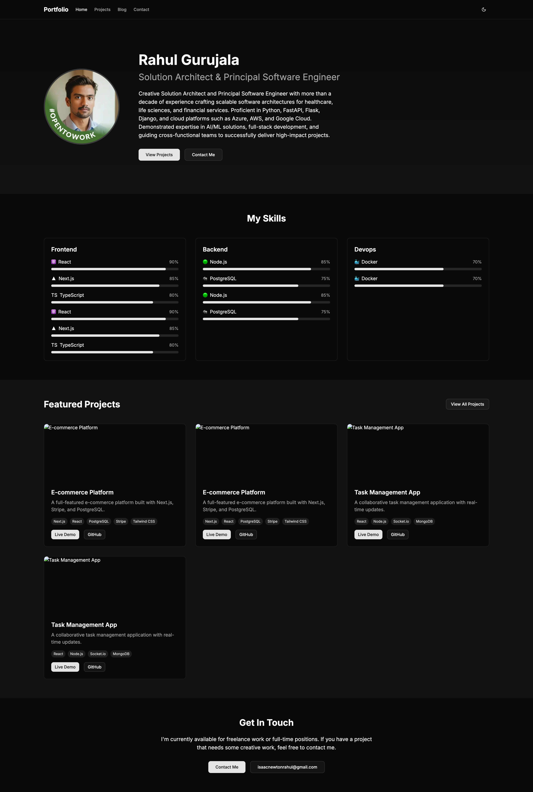
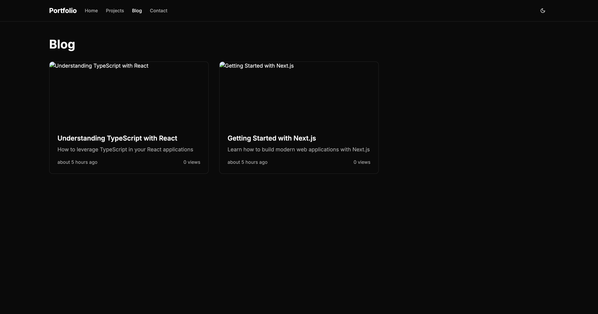
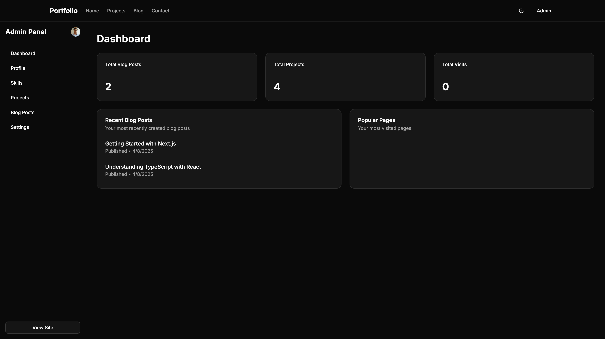
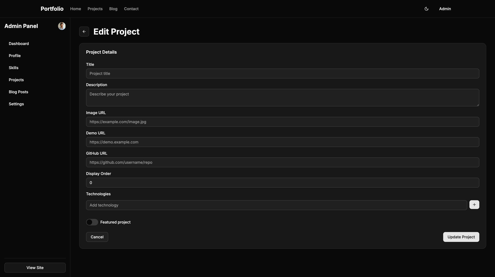

# Modern Developer Portfolio

A full-featured developer portfolio and blog built with Next.js, Drizzle ORM, and Clerk authentication.



## Features

- 🚀 **Modern Tech Stack**: Next.js 14 with App Router, TypeScript, and Tailwind CSS
- 🔐 **Authentication**: Secure admin access with Clerk
- 📊 **Database**: PostgreSQL with Drizzle ORM for type-safe database operations
- 📝 **Content Management**: Built-in CMS for managing projects, blog posts, and skills
- 📱 **Responsive Design**: Looks great on all devices
- 🌓 **Dark Mode**: Supports light and dark themes
- 📈 **Analytics**: Simple visitor tracking for pages
- 🖼️ **Image Uploads**: Cloudinary integration for image management
- 🔍 **SEO Friendly**: Optimized for search engines

## Demo

Check out the live demo: [https://personal-portfolio-alpha-virid.vercel.app/](https://personal-portfolio-alpha-virid.vercel.app/)

## Screenshots

<details>
<summary>View Screenshots</summary>

### Home Page



### Blog



### Admin Dashboard



### Project Editor



</details>

## Getting Started

### Prerequisites

- Node.js 18+ or Bun
- PostgreSQL database (or Neon serverless Postgres)
- Clerk account for authentication
- Cloudinary account for image uploads

### Environment Variables

Create a `.env` file in the root directory with the following variables:

```
# Database
DATABASE_URL=your_postgres_connection_string

# Clerk Authentication
NEXT_PUBLIC_CLERK_PUBLISHABLE_KEY=your_clerk_publishable_key
CLERK_SECRET_KEY=your_clerk_secret_key
NEXT_PUBLIC_CLERK_SIGN_IN_URL=/sign-in
NEXT_PUBLIC_CLERK_SIGN_UP_URL=/sign-up
NEXT_PUBLIC_CLERK_AFTER_SIGN_IN_URL=/admin/dashboard
NEXT_PUBLIC_CLERK_AFTER_SIGN_UP_URL=/admin/dashboard

# Cloudinary
CLOUDINARY_CLOUD_NAME=your_cloud_name
CLOUDINARY_API_KEY=your_api_key
CLOUDINARY_API_SECRET=your_api_secret
```

### Installation

1. Clone the repository:

```bash
git clone https://github.com/rahulgurujala/personal-portfolio.git
cd personal-portfolio
```

2. Install dependencies:

```bash
# Using npm
npm install

# Using Bun
bun install
```

3. Set up the database:

```bash
# Generate migrations
npm run db:generate

# Push migrations to database
npm run db:push

# Seed the database with initial data (optional)
npm run db:seed
```

4. Start the development server:

```bash
npm run dev
# or
bun dev
```

Open [http://localhost:3000](http://localhost:3000) with your browser to see the result.

## Project Structure

```
portfolio/
├── public/            # Static assets
├── src/
│   ├── app/           # Next.js app router pages
│   │   ├── admin/     # Admin panel pages
│   │   ├── api/       # API routes
│   │   ├── blog/      # Blog pages
│   │   └── ...        # Other pages
│   ├── components/    # React components
│   │   ├── blog/      # Blog-related components
│   │   ├── layout/    # Layout components
│   │   ├── shared/    # Shared components
│   │   └── ui/        # UI components
│   ├── hooks/         # Custom React hooks
│   ├── lib/           # Utility functions and libraries
│   │   ├── db/        # Database configuration and schema
│   │   └── ...        # Other utilities
│   └── middleware.ts  # Next.js middleware
├── drizzle/           # Drizzle migrations
├── drizzle.config.ts  # Drizzle configuration
└── ...                # Other configuration files
```

## Key Technologies

- Frontend : Next.js 14, React, TypeScript, Tailwind CSS
- UI Components : Radix UI primitives with custom styling
- Database : PostgreSQL with Drizzle ORM
- Authentication : Clerk for user management
- Image Storage : Cloudinary
- Deployment : Vercel (recommended)
- Content Editing : Custom rich text editor based on TipTap

## Admin Panel

The admin panel allows you to:

- Manage your profile information
- Create and edit projects
- Write and publish blog posts
- Add and update skills
- View visitor statistics

To access the admin panel:

1. Sign in at `/sign-in`
2. After signing in, you'll be redirected to `/admin/dashboard`
3. Make sure your user has the `isAdmin` flag set to `true` in the database

## Database Schema

The application uses the following database tables:

- `profile`: Your personal information
- `projects`: Portfolio projects
- `skills`: Technical skills with categories and proficiency levels
- `blog_posts`: Blog content
- `tags`: Blog post tags
- `blog_posts_tags`: Junction table for blog posts and tags
- `visitor_stats`: Page visit statistics

## API Routes

The application provides the following API endpoints:

- /api/profile - GET, PUT - Manage profile information
- /api/projects - GET, POST - List and create projects
- /api/projects/[id] - GET, PUT, DELETE - Manage individual projects
- /api/blog - GET, POST - List and create blog posts
- /api/blog/[id] - GET, PUT, DELETE - Manage individual blog posts
- /api/skills - GET, POST - List and create skills
- /api/skills/[id] - GET, PUT, DELETE - Manage individual skills
- /api/visitor - POST - Track page visits

## Deployment

### Deploy on Vercel

The easiest way to deploy your Next.js app is to use the [Vercel Platform](https://vercel.com/new).

1. Push your code to a GitHub repository
2. Import the project to Vercel
3. Set up the environment variables
4. Deploy

### Other Deployment Options

You can also deploy to other platforms that support Next.js:

- [Netlify](https://www.netlify.com/)
- [AWS Amplify](https://aws.amazon.com/amplify/)
- [DigitalOcean App Platform](https://www.digitalocean.com/products/app-platform)

## Customization

### Styling

This project uses Tailwind CSS for styling. You can customize the theme in the `tailwind.config.js` file.

### Components

UI components are built with [Radix UI](https://www.radix-ui.com/) and styled with Tailwind CSS.

### Content Structure

You can customize the structure of your portfolio by modifying:

- Project categories in the admin panel
- Skill categories and proficiency levels
- Blog post tags and organization

## Performance Optimization

This project implements several performance optimizations:

- Image optimization with Next.js Image component
- Server components for reduced client-side JavaScript
- Incremental Static Regeneration for blog pages
- Efficient database queries with Drizzle ORM

## Troubleshooting

### Common Issues

- Database Connection Errors : Ensure your DATABASE_URL is correct and the database is accessible
- Authentication Issues : Verify your Clerk API keys and configuration
- Image Upload Problems : Check your Cloudinary credentials and quota

### Getting Help

If you encounter any issues, please:

1. Check the existing [GitHub issues](https://github.com/rahulgurujala/personal-portfolio/issues)
2. Create a new issue with detailed information about your problem

## Contributing

Contributions are welcome! Please feel free to submit a Pull Request.

### Development Workflow

1. Fork the repository
2. Create a feature branch ( git checkout -b feature/amazing-feature )
3. Commit your changes ( git commit -m 'Add some amazing feature' )
4. Push to the branch ( git push origin feature/amazing-feature )
5. Open a Pull Request

## License

This project is licensed under the MIT License - see the LICENSE file for details.

## Acknowledgements

- [Next.js](https://nextjs.org/)
- [Clerk](https://clerk.dev/)
- [Drizzle ORM](https://orm.drizzle.team/)
- [Tailwind CSS](https://tailwindcss.com/)
- [Radix UI](https://www.radix-ui.com/)
- [Cloudinary](https://cloudinary.com/)

## Author

Rahul Gurujala - [GitHub](https://github.com/rahulgurujala/)
